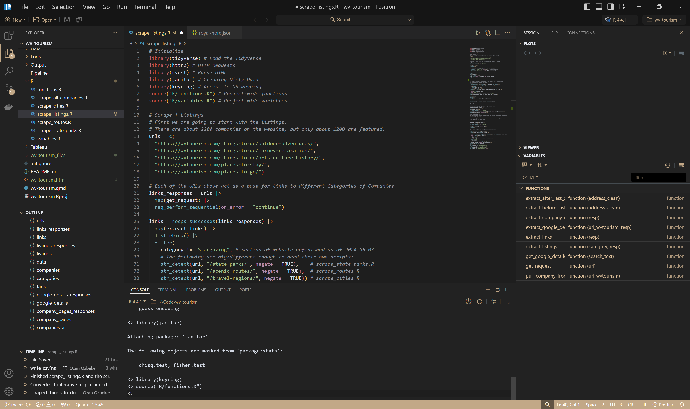

# Royal Nord
Royal Nord is a theme for Positron & VS Code designed for R users.

# Installation
As of writing, Positron & VS Code keep extensions in:

### Positron
- **Windows:** `C:\Program Files\Positron\resources\app\extensions`
- **Mac:** `/Users/<YourUsername>/.vscode/extensions`
- **Linux:** `/home/<YourUsername>/.vscode/extensions`

### VS Code
- **Windows:** `C:\Users\<YourUsername>\.vscode\extensions`
- **Mac:** `/Users/<YourUsername>/.vscode/extensions`
- **Linux:** `/home/<YourUsername>/.vscode/extensions`

Just drop the `theme-royal-nord` folder in the `extensions` directory and reload the environment. The IDE will (probably) prompt you to refresh and the theme should be available for use!

# Credits
The theme is heavily inspired from [Obsidian](https://obsidian.md/) for the UI, [Nord](https://www.nordtheme.com/) for the code syntax, and some stylistic choices by yours truly.